= Development

== Architecture

The service uses a privilege-separated architecture to ensure security and correct notification delivery.

=== System Services (root)

* `aptupdatechecker_apt_cache_update` — refreshes the APT package cache via `aptupdatechecker update`, then signals each active user session by touching `/run/user/<uid>/apt-updates-available`.
* `aptupdatechecker_autoclean` — runs `apt autoclean` weekly.
* `aptupdatechecker_autoremove` — runs `apt autoremove` weekly.

=== User Services (per-user session)

* `aptupdatechecker_apt_update_checker.path` — watches for `/run/user/<uid>/apt-updates-available`. When the system service creates this file, the path unit activates the corresponding service, which runs `aptupdatechecker check`, sends a desktop notification if updates are available, then removes the file.
* `aptupdatechecker_firmware_update_checker` — runs `aptupdatechecker fwupd` on a timer to check for firmware updates.

Notification code runs inside the user session so it has D-Bus access for desktop notifications.

=== Systemd Unit Locations

[cols="1,2",options="header"]
|===
| Path | Contents

| `/lib/systemd/system/`
| System timers and services (root-level)

| `/usr/lib/systemd/user/`
| User path unit, timers, and services
|===

== Project Structure

----
src/                    Application source
systemd/system/         System-level unit files (source)
systemd/user/           User-level unit files (source)
debian/                 Maintainer scripts for dpkg
----

== Build Requirements

* Rust toolchain (rustc >= 1.85, required for edition 2024)
* `cargo-deb` (`cargo install cargo-deb`)
* Development libraries: `libapt-pkg-dev`, `libdbus-1-dev`, `pkg-config`
* `just` (optional, for recipe shortcuts)

== Building

[source,bash]
----
# Check for errors without building
just check

# Build release binary
just build

# Build Debian package
just deb
----

Or with plain Cargo:

[source,bash]
----
cargo build --release
cargo deb
----

== Testing

[source,bash]
----
# Run all tests
just test

# Run tests with output visible
just test-verbose

# Run full CI checks (check + clippy + fmt + test)
just ci
----

== Testing Manually

Test the APT cache update (requires root):

[source,bash]
----
sudo ./target/release/aptupdatechecker update
----

Test the APT update check (runs as user):

[source,bash]
----
./target/release/aptupdatechecker check
----

Test the firmware check (runs as user):

[source,bash]
----
./target/release/aptupdatechecker fwupd
----

== CI Container Image

The CI workflows run inside a Docker container (`tylerkelly13/rust-aptupdatechecker-ci:latest`) that includes all build dependencies pre-installed. The Dockerfile lives at `.github/workflows/Dockerfile` and is automatically built and pushed to Docker Hub when changed on `main`.

=== Required Repository Secrets

[cols="1,2",options="header"]
|===
| Secret | Description

| `DOCKERHUB_USERNAME`
| Docker Hub username for pushing the CI image

| `DOCKERHUB_TOKEN`
| Docker Hub access token (not your password — generate one at https://hub.docker.com/settings/security)
|===

== CI/CD Pipeline

The project uses reusable GitHub Actions workflows from `tylerkelly13/.github`.

[%collapsible]
.Raw Mermaid diagram source
====
[source,mermaid]
----
flowchart TD
    subgraph checks["check.yml — PR Checks"]
        A1["Triggers:\nworkflow_dispatch\npull_request (main, release/*)"]
        A1 --> A2["Job: Build_and_check\n(contents: read)"]
        A2 --> RC["rust-run-checks.yml\n(coverage: true)"]
    end

    subgraph deploy["deploy.yml — Deploy"]
        B1["Trigger:\npush tag v*"]
        B1 --> B2["Job: Checks"]
        B2 --> RC2["rust-run-checks.yml\n(coverage: false)"]
        RC2 --> B3["Job: Release\n(needs: Checks)"]
        B3 --> GHR["rust-gh-release.yml\n(artifact-id from Checks)"]
    end

    subgraph run_checks["rust-run-checks.yml (reusable)\nconcurrency: deploy, cancel-in-progress"]
        direction TB
        RCB["Build\n(rust-build.yml)"]
        RCL["Linting\n(rust-lint.yml)"]
        RCF["Formatting\n(rust-formatting.yml)"]
        RCT["Tests\n(rust-test.yml)"]
        RCC["Coverage\n(rust-coverage.yml)\nif: enabled"]
    end

    subgraph rust_build["rust-build.yml steps"]
        S1["cargo-setup:\ncheckout + cache Cargo deps"]
        S2["just build"]
        S3["just deb"]
        S4["sha256sum → checksums"]
        S5["Upload artifacts\n→ artifact-id"]
        S1 --> S2 --> S3 --> S4 --> S5
    end

    subgraph gh_release["rust-gh-release.yml steps"]
        R1["Download artifact\n(actions/download-artifact)"]
        R2["GitHub Release (draft)\n*.deb + checksums\n(softprops/action-gh-release)"]
        R1 --> R2
    end

    RC --> run_checks
    RC2 --> run_checks
    RCB --> rust_build
    GHR --> gh_release
----
====

=== Workflow summary

* **check.yml** — runs on PRs to `main`/`release/*` and manual dispatch. Calls `rust-run-checks.yml` with coverage enabled. Five parallel jobs: Build, Linting, Formatting, Tests, Coverage.
* **deploy.yml** — runs on `v*` tag push. Runs the same checks (without coverage), then creates a draft GitHub Release with `.deb` packages and checksums.

== Debian Packaging

The `debian/` directory contains maintainer scripts used by `cargo-deb`. `cargo-deb` reads unit files from `systemd/system/` and `systemd/user/` as defined in `Cargo.toml` under `[package.metadata.deb]`.

The maintainer scripts enable the system timer (`aptupdatechecker_apt_cache_update.timer`) automatically on package install. Users must enable user units manually — see the README installation instructions.
